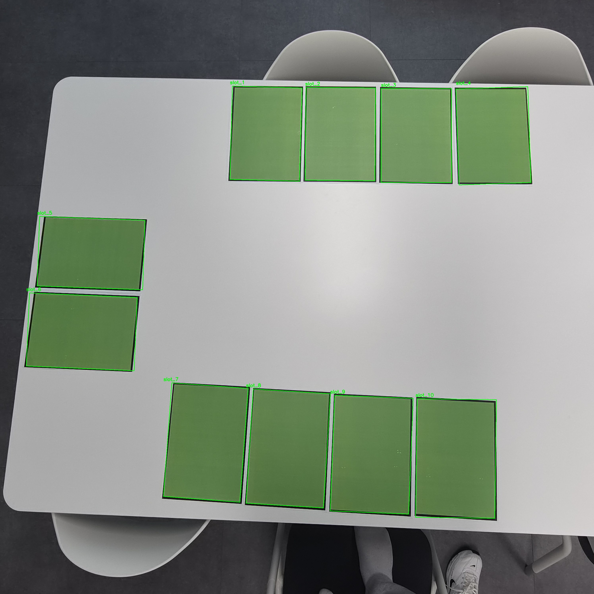
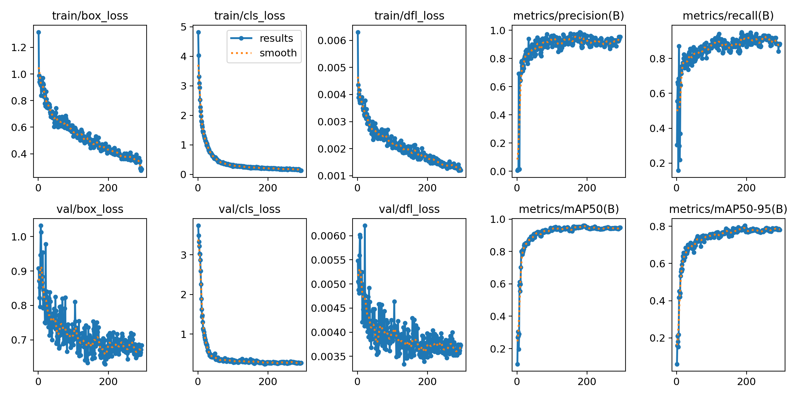
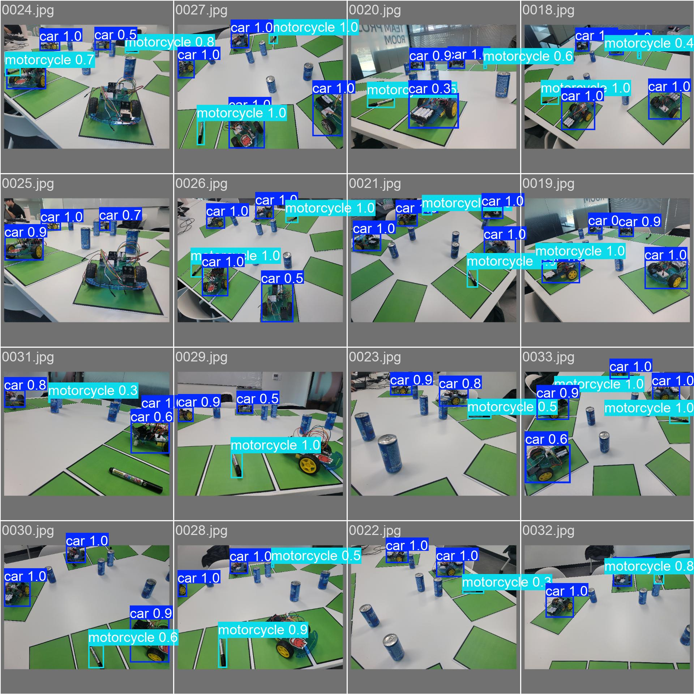

# YOLO Smart Parking Monitor

YOLO 차량 검출 결과와 주차면 ROI의 중첩률을 결합해 주차 공간의
`EMPTY / OCCUPIED` 상태를 표시하는 실시간 주차 관제 프로젝트입니다.

> 이 저장소는 부트캠프에서 완료한 3인 팀 프로젝트를 포트폴리오 목적으로
> 정리해 공개한 버전입니다. Git 커밋 날짜는 최초 개발 기간이 아니라
> 코드 정리 및 공개 시점을 나타냅니다.

## 담당 역할

- YOLO 차량 검출 모델 학습 및 결과 검증
- HSV, Contour 기반 주차면 ROI 추출
- 차량 Bounding Box와 ROI 중첩률 계산
- 중첩률 30% 기준 `EMPTY / OCCUPIED` 판정
- 차량 Box, 주차면 상태, 전체·점유·빈자리 결과 화면 구현

## 실행 화면



## 처리 과정

```text
Camera frame
  -> YOLO vehicle detection
  -> HSV/Contour parking-slot extraction
  -> Vehicle box and ROI intersection
  -> Occupied when overlap ratio >= 30%
  -> OpenCV monitoring screen
```

주차면은 조명과 카메라 위치 변화에 대응하기 위해 기본 5초 간격으로 다시
검출합니다. 주차면 번호는 화면의 위에서 아래, 같은 행에서는 왼쪽에서
오른쪽 순으로 정렬합니다.

## 모델 학습

| 항목 | 설정 |
|---|---:|
| Model | YOLO26n |
| Image size | 640 |
| Batch size | 16 |
| Epochs | 300 |
| Classes | car, motorcycle |
| Data split | Train 80% / Validation 20% |

포함된 학습 로그의 마지막 기록(epoch 295)은 다음과 같습니다.

| Precision | Recall | mAP50 | mAP50-95 |
|---:|---:|---:|---:|
| 0.953 | 0.884 | 0.948 | 0.781 |





## 프로젝트 구조

```text
.
├── arduino/
│   └── parking_led.ino
├── assets/
├── models/
│   └── best.pt
├── config.py
├── create_dataset_yaml.py
├── detect_slots.py
├── monitor.py
├── prepare_dataset.py
├── train.py
└── slots.json
```

## 설치 및 실행

Python 3.10 이상을 권장합니다.

```bash
python -m venv .venv
```

Windows:

```bash
.venv\Scripts\activate
pip install -r requirements.txt
python monitor.py --source 0
```

영상 파일을 사용할 수도 있습니다.

```bash
python monitor.py --source path/to/video.mp4
```

주차면만 다시 추출하려면:

```bash
python detect_slots.py --image assets/empty_parking.jpg
```

## 데이터셋 준비와 재학습

원본 촬영 데이터는 용량과 팀 데이터 관리 문제로 저장소에 포함하지
않았습니다. LabelMe 형식의 `train`, `valid` 폴더를 `project_data` 아래에
배치한 후 실행합니다.

```bash
python prepare_dataset.py
python create_dataset_yaml.py
python train.py
```

## 한계와 개선 방향

- 고정 카메라와 특정 색상의 주차선에 맞춘 방식입니다.
- 조명 변화가 크면 HSV 범위를 환경에 맞게 다시 조정해야 합니다.
- 차량 위치와 촬영 각도에 따라 경계 부근의 점유 판정 오차가 발생할 수 있습니다.
- 향후 주차면 검출 모델 또는 카메라 캘리브레이션을 적용할 수 있습니다.

